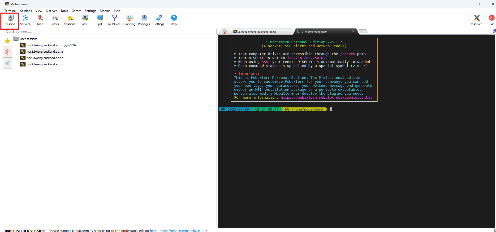
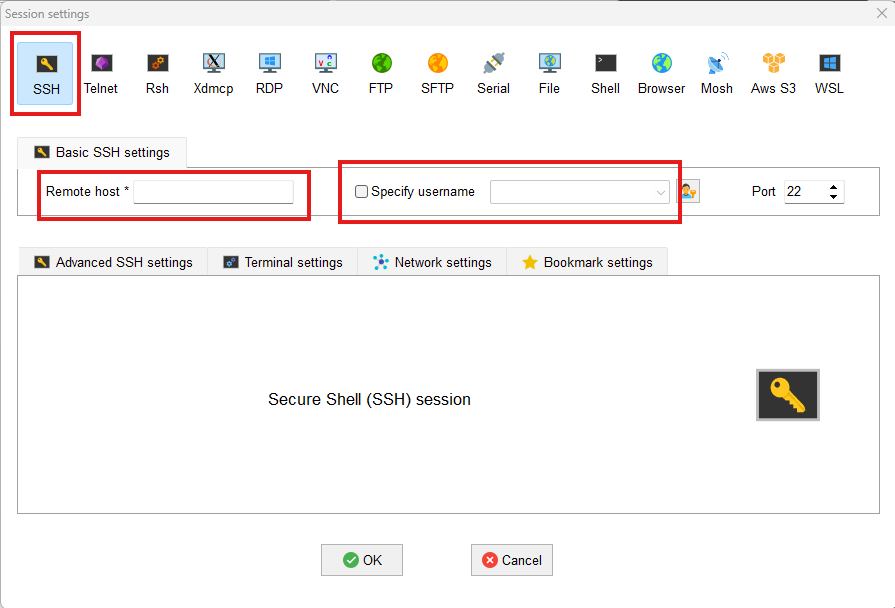
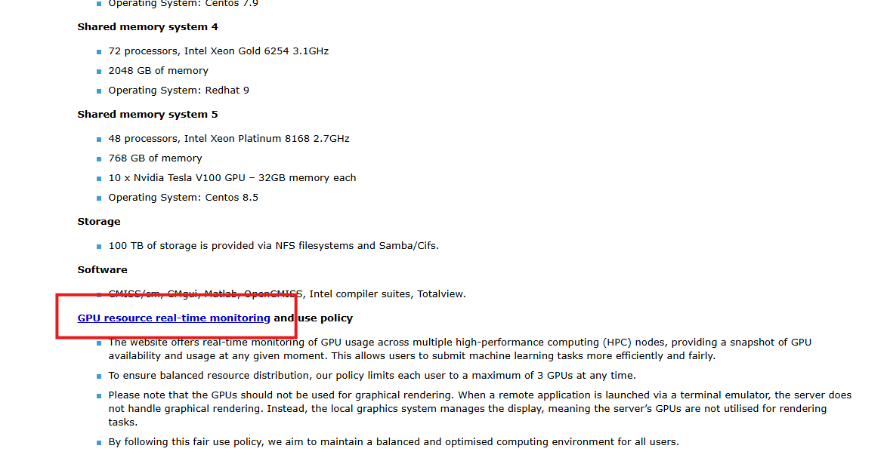
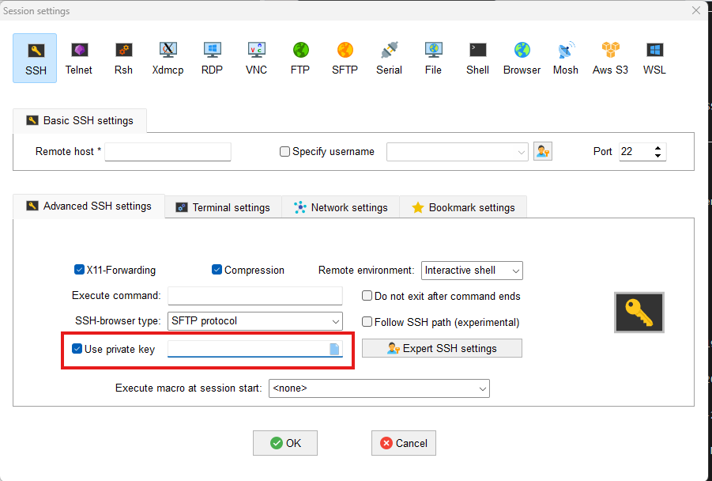

# Login by MobaXterm
1. Click Session


2. Click SSH, fill in Remote host and your username, and click OK



### Remote Host:
#### hpc2 (CUDA version 12.4)
hpc2.bioeng.auckland.ac.nz
#### hpc5 (CUDA version 12.6)
hpc5.bioeng.auckland.ac.nz
#### hpc6 (CUDA version 12.8)
hpc6.bioeng.auckland.ac.nz
#### hpc7 (CUDA version 12.6)
hpc7.bioeng.auckland.ac.nz


# Multi Task
### Multi Task and Background work code:

```
nohup python filename.py > log.log 2>&1 &
```

The task will not stop if you close the connection. And the log which displays on the terminal will output to the log.out file.


### Check all your tasks:

```
pgrep -u $USER -a python
```

### Check your tasks in the current session:

```
jobs
```

### Kill your task 
If you want to stop a background task before it is finished:

```
pkill -f filename.py
```

# Check GPU usage
### Check GPU usage of current HPC:

```
nvidia-smi
```

### Check GPU usage of all the HPCs:
https://intranet.abi.auckland.ac.nz/en/it-and-printing/computing-resources.html

Click this



# Auto Login
Login without inputting password everytime
### Step 1:

run this in your local laptop terminal
```
ssh-keygen -t rsa -b 4096 -C "your_email@aucklanduni.ac.nz"
```

it will generate 2 files
- ~/.ssh/id_rsa  
- ~/.ssh/id_rsa.pub  

### Step 2:
copy all the contents of this file
- ~/.ssh/id_rsa.pub  

to HPC
```
/people/your_username/.ssh/authorized_keys
```

save the file

### Step3:
Select your `~/.ssh/id_rsa` file to the primary key


### Step4:
Reconnect


# Change Home Path
Change the default path after login:
### Step1:
open
```
/people/your_username/.bashrc
```

### Step2:

add
```
cd /hpc/ your_username/
```
to the end of the file

### Step3:
save and quit