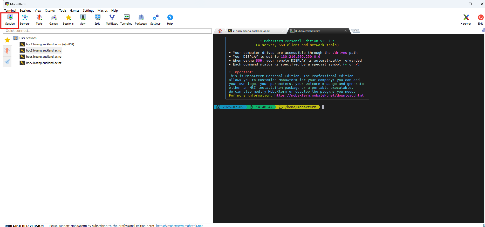
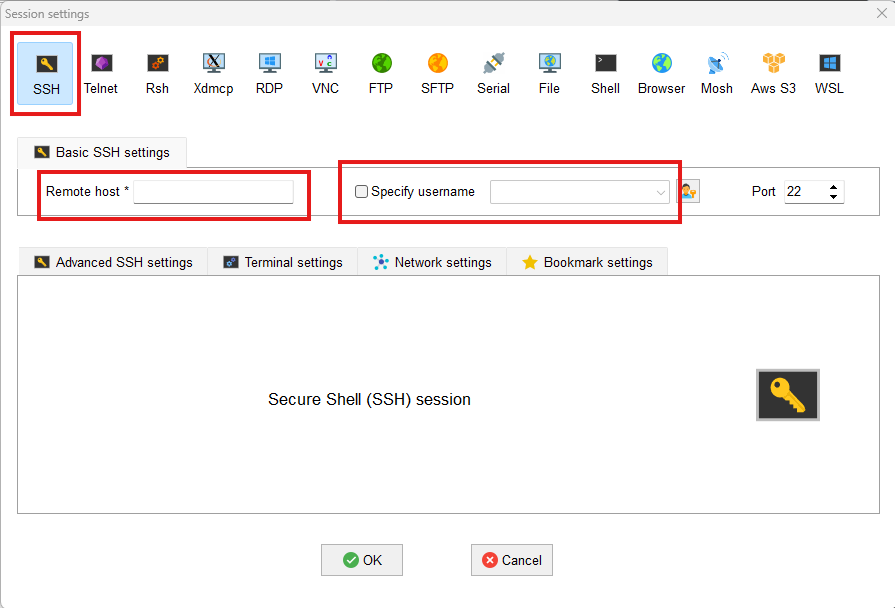
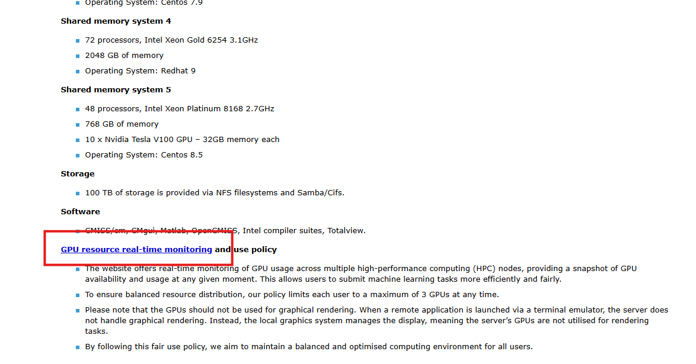
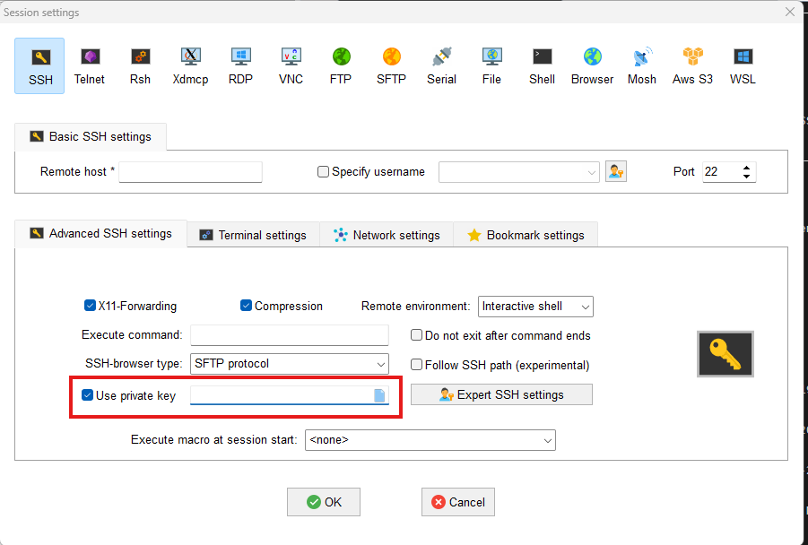

# Login by MobaXterm
1. Click Session


2. Click SSH, fill in Remote host and your username, and click OK



### Remote Host:
#### hpc2 (CUDA version 12.4)
hpc2.bioeng.auckland.ac.nz
#### hpc5 (CUDA version 12.6)
hpc5.bioeng.auckland.ac.nz
#### hpc6 (CUDA version 12.8)
hpc6.bioeng.auckland.ac.nz
#### hpc7 (CUDA version 12.6)
hpc7.bioeng.auckland.ac.nz


# Multi Task
## nohup
### Multi Task and Background work code:

```
nohup python filename.py > log.log 2>&1 &
```

The task will not stop if you close the connection. And the log which displays on the terminal will output to the log.out file.


### Check all your tasks:

```
pgrep -u $USER -a python
```

### Check your tasks in the current session:

```
jobs
```

### Kill your task 
If you want to stop a background task before it is finished:

```
pkill -f filename.py
```

## tmux
### Session Management

#### Create Session

```
tmux new -s exp
```

or

```
tmux new-session -s exp
```

#### List Sessions
```
tmux ls
```

or

```
tmux list-sessions
```

#### Attach Session
```
tmux attach -t exp
```

or

```
tmux a -t exp
```


#### Detach Session
```
Ctrl+B D
```


#### Kill Session
```
tmux kill-session -t exp
```

### Window Management
#### Create New Window
##### Create a new window in the current session
Shortcut: 
```
Ctrl+B C
```
Command:
```
tmux new-window
```

##### Create a window with a specific name
```
tmux new-window -n train
```

#### List Windows
List all windows in the current session:
Shortcut:
```
Ctrl+B W
```
Command:
```
tmux list-windows
```

#### Switch Between Windows

##### Next Window

```
Ctrl+B N
```

##### Previous Window

```
Ctrl+B P
```

##### Switch to a Specific Window

```
Ctrl+B 0
```

```
Ctrl+B 1
```

```
Ctrl+B 2
```


#### Rename Window

Shortcut:

```
Ctrl+B ,
```

Command:

```
tmux rename-window new_name
```


#### Kill Window

##### Kill the current window

Shortcut:

```
Ctrl+B &
```

Command:

```
tmux kill-window
```

##### Kill a specific window

```
tmux kill-window -t 2
```


#### Move Window

##### Move the current window to a specific index

Shortcut:

```
Ctrl+B .
```

Command:

```
tmux move-window -t 3
```


### Kill Server
```
tmux kill-server
```


# Check GPU usage
### Check GPU usage of current HPC:

```
nvidia-smi
```

### Check GPU usage of all the HPCs:
https://intranet.abi.auckland.ac.nz/en/it-and-printing/computing-resources.html

Click this



# Auto Login
Login without inputting password everytime
### Step 1:

run this in your local laptop terminal
```
ssh-keygen -t rsa -b 4096 -C "your_email@aucklanduni.ac.nz"
```

it will generate 2 files
- ~/.ssh/id_rsa  
- ~/.ssh/id_rsa.pub  

### Step 2:
copy all the contents of this file
- ~/.ssh/id_rsa.pub  

to HPC
```
/people/your_username/.ssh/authorized_keys
```

save the file

### Step3:
Select your `~/.ssh/id_rsa` file to the primary key


### Step4:
Reconnect


# Change Home Path
Change the default path after login:
### Step1:
open
```
/people/your_username/.bashrc
```

### Step2:

add
```
cd /hpc/ your_username/
```
to the end of the file

### Step3:
save and quit